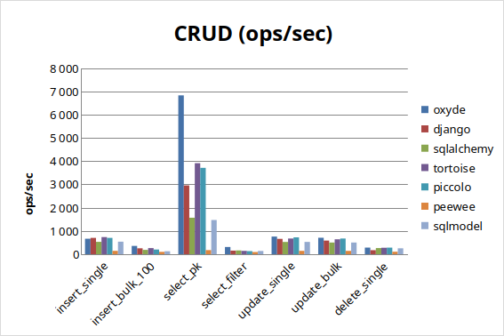
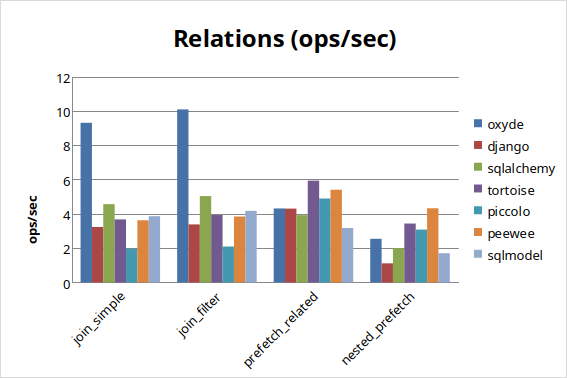
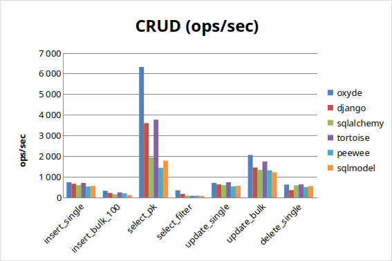
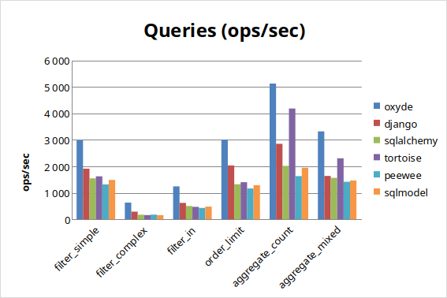
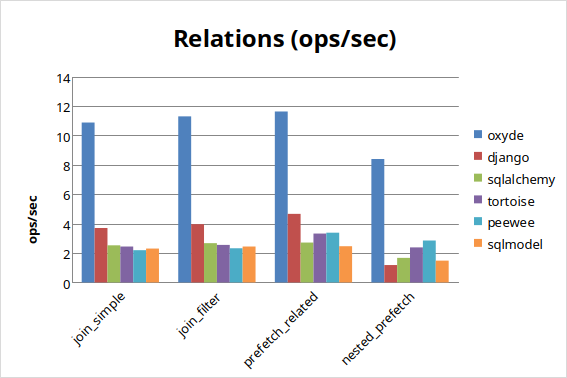
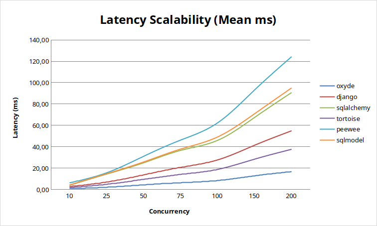
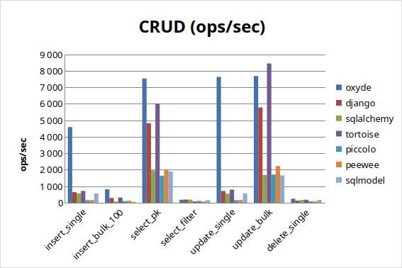
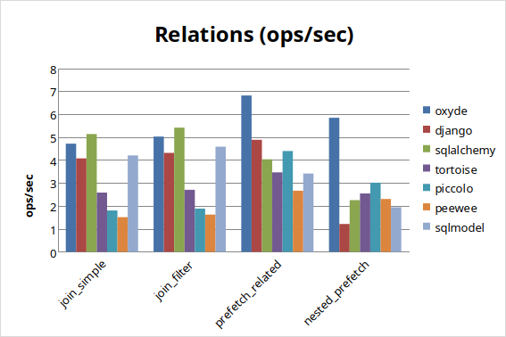
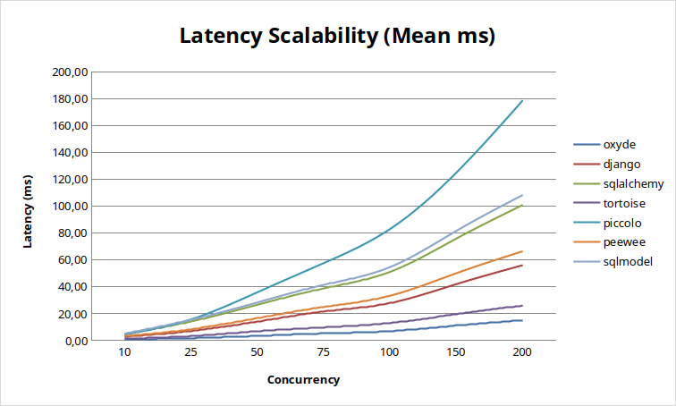

# Benchmarks

!!! info "Benchmark Date"
    These benchmarks were run on **March 11, 2026** with Oxyde 0.5.0.
    Results may vary depending on hardware and database configuration.

## Summary (average ops/sec)

### PostgreSQL

| Rank | ORM | Avg ops/sec |
|------|-----|-------------|
| 1 | Oxyde | 1,475 |
| 2 | Piccolo | 932 |
| 3 | Tortoise | 888 |
| 4 | Django | 736 |
| 5 | SQLAlchemy | 445 |
| 6 | SQLModel | 431 |
| 7 | Peewee | 80 |

### MySQL

| Rank | ORM | Avg ops/sec |
|------|-----|-------------|
| 1 | Oxyde | 1,239 |
| 2 | Tortoise | 794 |
| 3 | Django | 714 |
| 4 | SQLAlchemy | 536 |
| 5 | SQLModel | 505 |
| 6 | Peewee | 461 |

### SQLite

| Rank | ORM | Avg ops/sec |
|------|-----|-------------|
| 1 | Oxyde | 2,525 |
| 2 | Tortoise | 1,882 |
| 3 | Django | 1,294 |
| 4 | SQLAlchemy | 588 |
| 5 | SQLModel | 567 |
| 6 | Peewee | 548 |
| 7 | Piccolo | 469 |

---

## PostgreSQL Results

### CRUD Operations

| Test | asyncpg | Oxyde | Django | SQLAlchemy | Tortoise | Piccolo | Peewee | SQLModel |
|------|---------|-------|--------|------------|----------|---------|--------|----------|
| insert_single | 769 | 664 | 701 | 531 | 735 | 700 | 143 | 537 |
| insert_bulk_100 | 444 | 354 | 252 | 185 | 261 | 201 | 100 | 126 |
| select_pk | 7,181 | 6,823 | 2,956 | 1,566 | 3,910 | 3,708 | 174 | 1,468 |
| select_filter | 829 | 308 | 153 | 162 | 143 | 132 | 93 | 138 |
| update_single | 747 | 756 | 659 | 526 | 674 | 723 | 144 | 528 |
| update_bulk | 657 | 707 | 586 | 501 | 640 | 673 | 142 | 501 |
| delete_single | 275 | 282 | 172 | 263 | 276 | 282 | 106 | 253 |

### Query Operations

| Test | asyncpg | Oxyde | Django | SQLAlchemy | Tortoise | Piccolo | Peewee | SQLModel |
|------|---------|-------|--------|------------|----------|---------|--------|----------|
| filter_simple | 5,731 | 5,017 | 2,829 | 1,449 | 3,524 | 3,491 | 170 | 1,428 |
| filter_complex | 1,489 | 599 | 281 | 310 | 280 | 263 | 122 | 267 |
| filter_in | 2,657 | 620 | 653 | 602 | 769 | 656 | 149 | 562 |
| order_limit | 4,882 | 4,363 | 2,284 | 1,347 | 2,051 | 2,688 | 169 | 1,296 |
| aggregate_count | 6,132 | 7,319 | 3,715 | 1,584 | 4,333 | 4,397 | 175 | 1,599 |
| aggregate_mixed | 4,990 | 5,374 | 1,871 | 1,388 | 2,629 | 3,421 | 173 | 1,383 |

### Relations

| Test | asyncpg | Oxyde | Django | SQLAlchemy | Tortoise | Piccolo | Peewee | SQLModel |
|------|---------|-------|--------|------------|----------|---------|--------|----------|
| join_simple | 22 | 9 | 3 | 5 | 4 | 2 | 4 | 4 |
| join_filter | 23 | 10 | 3 | 5 | 4 | 2 | 4 | 4 |
| prefetch_related | 33 | 4 | 4 | 4 | 6 | 5 | 5 | 3 |
| nested_prefetch | 25 | 3 | 1 | 2 | 3 | 3 | 4 | 2 |

### Concurrent Operations

| Concurrency | asyncpg | Oxyde | Django | SQLAlchemy | Tortoise | Piccolo | Peewee | SQLModel |
|-------------|---------|-------|--------|------------|----------|---------|--------|----------|
| 10 | 1,304 | 1,077 | 282 | 224 | 544 | 517 | 18 | 214 |
| 50 | 262 | 233 | 57 | 5 | 112 | 105 | 4 | 5 |
| 100 | 132 | 121 | 29 | 4 | 56 | 54 | 2 | 4 |

### Scalability

---

## MySQL Results

### CRUD Operations

| Test | aiomysql | Oxyde | Django | SQLAlchemy | Tortoise | Peewee | SQLModel |
|------|----------|-------|--------|------------|----------|--------|----------|
| insert_single | 712 | 736 | 665 | 596 | 703 | 529 | 561 |
| insert_bulk_100 | 409 | 324 | 219 | 156 | 245 | 197 | 112 |
| select_pk | 6,662 | 6,315 | 3,597 | 1,938 | 3,766 | 1,435 | 1,778 |
| select_filter | 133 | 346 | 173 | 88 | 77 | 88 | 79 |
| update_single | 719 | 704 | 634 | 596 | 736 | 539 | 566 |
| update_bulk | 2,290 | 2,057 | 1,449 | 1,332 | 1,740 | 1,312 | 1,218 |
| delete_single | 700 | 624 | 352 | 586 | 632 | 503 | 554 |

### Query Operations

| Test | aiomysql | Oxyde | Django | SQLAlchemy | Tortoise | Peewee | SQLModel |
|------|----------|-------|--------|------------|----------|--------|----------|
| filter_simple | 2,921 | 2,978 | 1,912 | 1,546 | 1,622 | 1,317 | 1,486 |
| filter_complex | 270 | 632 | 289 | 172 | 160 | 177 | 157 |
| filter_in | 718 | 1,242 | 620 | 501 | 470 | 429 | 480 |
| order_limit | 2,405 | 3,003 | 2,033 | 1,323 | 1,399 | 1,163 | 1,288 |
| aggregate_count | 4,638 | 5,122 | 2,849 | 2,016 | 4,180 | 1,630 | 1,946 |
| aggregate_mixed | 3,312 | 3,318 | 1,637 | 1,564 | 2,302 | 1,416 | 1,465 |

### Relations

| Test | aiomysql | Oxyde | Django | SQLAlchemy | Tortoise | Peewee | SQLModel |
|------|----------|-------|--------|------------|----------|--------|----------|
| join_simple | 4 | 11 | 4 | 3 | 2 | 2 | 2 |
| join_filter | 4 | 11 | 4 | 3 | 3 | 2 | 2 |
| prefetch_related | 6 | 12 | 5 | 3 | 3 | 3 | 2 |
| nested_prefetch | 5 | 8 | 1 | 2 | 2 | 3 | 1 |

### Concurrent Operations

| Concurrency | aiomysql | Oxyde | Django | SQLAlchemy | Tortoise | Peewee | SQLModel |
|-------------|----------|-------|--------|------------|----------|--------|----------|
| 10 | 1,018 | 1,201 | 352 | 250 | 530 | 160 | 232 |
| 50 | 206 | 227 | 73 | 40 | 105 | 32 | 39 |
| 100 | 103 | 119 | 36 | 22 | 53 | 16 | 20 |

### Scalability

---

## SQLite Results

### CRUD Operations

| Test | aiosqlite | Oxyde | Django | SQLAlchemy | Tortoise | Piccolo | Peewee | SQLModel |
|------|-----------|-------|--------|------------|----------|---------|--------|----------|
| insert_single | 748 | 4,585 | 647 | 568 | 715 | 153 | 164 | 561 |
| insert_bulk_100 | 635 | 817 | 288 | 75 | 318 | 100 | 120 | 63 |
| select_pk | 42,752 | 7,528 | 4,822 | 1,958 | 6,004 | 1,638 | 1,969 | 1,896 |
| select_filter | 1,060 | 183 | 193 | 187 | 77 | 115 | 73 | 156 |
| update_single | 823 | 7,628 | 710 | 546 | 798 | 158 | 165 | 567 |
| update_bulk | 14,571 | 7,681 | 5,776 | 1,684 | 8,441 | 1,708 | 2,223 | 1,660 |
| delete_single | 183 | 242 | 128 | 175 | 181 | 86 | 93 | 170 |

### Query Operations

| Test | aiosqlite | Oxyde | Django | SQLAlchemy | Tortoise | Piccolo | Peewee | SQLModel |
|------|-----------|-------|--------|------------|----------|---------|--------|----------|
| filter_simple | 18,577 | 5,294 | 4,411 | 1,903 | 5,241 | 1,512 | 1,758 | 1,822 |
| filter_complex | 1,869 | 314 | 311 | 318 | 142 | 189 | 127 | 261 |
| filter_in | 7,179 | 1,153 | 1,008 | 872 | 559 | 564 | 428 | 754 |
| order_limit | 12,284 | 4,235 | 3,295 | 1,673 | 2,937 | 1,346 | 1,342 | 1,601 |
| aggregate_count | 45,096 | 11,807 | 6,360 | 2,077 | 13,825 | 1,838 | 2,245 | 2,042 |
| aggregate_mixed | 12,929 | 6,438 | 2,407 | 1,689 | 4,475 | 1,491 | 1,863 | 1,672 |

### Relations

| Test | aiosqlite | Oxyde | Django | SQLAlchemy | Tortoise | Piccolo | Peewee | SQLModel |
|------|-----------|-------|--------|------------|----------|---------|--------|----------|
| join_simple | 26 | 5 | 4 | 5 | 3 | 2 | 2 | 4 |
| join_filter | 27 | 5 | 4 | 5 | 3 | 2 | 2 | 5 |
| prefetch_related | 40 | 7 | 5 | 4 | 3 | 4 | 3 | 3 |
| nested_prefetch | 32 | 6 | 1 | 2 | 3 | 3 | 2 | 2 |

### Concurrent Operations

| Concurrency | aiosqlite | Oxyde | Django | SQLAlchemy | Tortoise | Piccolo | Peewee | SQLModel |
|-------------|-----------|-------|--------|------------|----------|---------|--------|----------|
| 10 | 3,397 | 1,346 | 343 | 204 | 738 | 221 | 297 | 197 |
| 50 | 703 | 289 | 71 | 38 | 145 | 28 | 60 | 35 |
| 100 | 350 | 143 | 36 | 20 | 77 | 12 | 30 | 18 |

### Scalability

---

## Latency (PostgreSQL)

### Mean Latency (ms)

| Test | asyncpg | Oxyde | Django | SQLAlchemy | Tortoise | Piccolo | Peewee | SQLModel |
|------|---------|-------|--------|------------|----------|---------|--------|----------|
| insert_single | 1.300 | 1.505 | 1.426 | 1.883 | 1.361 | 1.428 | 6.970 | 1.861 |
| select_pk | 0.139 | 0.147 | 0.338 | 0.638 | 0.256 | 0.270 | 5.737 | 0.681 |
| update_single | 1.339 | 1.323 | 1.518 | 1.901 | 1.484 | 1.383 | 6.960 | 1.895 |

### P99 Latency (ms)

| Test | asyncpg | Oxyde | Django | SQLAlchemy | Tortoise | Piccolo | Peewee | SQLModel |
|------|---------|-------|--------|------------|----------|---------|--------|----------|
| insert_single | 1.367 | 6.959 | 1.660 | 3.314 | 1.637 | 1.750 | 10.516 | 2.380 |
| select_pk | 0.159 | 0.234 | 0.363 | 0.854 | 0.294 | 0.528 | 6.194 | 0.888 |
| update_single | 1.417 | 2.156 | 1.734 | 5.442 | 5.008 | 1.655 | 8.108 | 2.016 |

---

## Memory Usage (PostgreSQL)

Peak memory (MB):

| Test | asyncpg | Oxyde | Django | SQLAlchemy | Tortoise | Piccolo | Peewee | SQLModel |
|------|---------|-------|--------|------------|----------|---------|--------|----------|
| insert_single | 37.6 | 52.7 | 66.4 | 58.3 | 51.0 | 41.1 | 60.1 | 67.3 |
| select_pk | 43.6 | 57.6 | 72.5 | 64.0 | 56.1 | 47.0 | 64.3 | 69.6 |
| join_simple | 73.7 | 80.7 | 107.8 | 99.0 | 85.5 | 100.5 | 98.5 | 110.1 |
| nested_prefetch | 78.5 | 104.2 | 159.3 | 115.5 | 121.5 | 108.4 | 105.0 | 128.0 |

---

## Test Environment

| Parameter | Value |
|-----------|-------|
| CPU | Intel Core i7-11800H @ 2.30GHz |
| Cores | 2 |
| RAM | 4 GB |
| OS | Linux 6.17.0-14-generic |
| Python | 3.12.13 |
| Container | Docker |

### Package Versions

| Package | Version |
|---------|---------|
| oxyde | 0.5.0 |
| asyncpg | 0.31.0 |
| django | 6.0.3 |
| sqlalchemy | 2.0.48 |
| tortoise-orm | 1.1.6 |
| piccolo | 1.33.0 |
| peewee | 4.0.1 |
| sqlmodel | 0.0.37 |

### Test Data

- Users: 1,000
- Posts per user: 20

---

## Methodology

Benchmarks are available in a separate repository: [oxyde-benchmarks](https://github.com/mr-fatalyst/oxyde-benchmarks)

**Configuration:**

- 100 iterations per test
- 10 warmup iterations
- Connection pool warmed up before measurements
- Each ORM tested in isolated subprocess for accurate memory measurement
- Each ORM tested with recommended async drivers
- Raw driver baselines (asyncpg, aiomysql, aiosqlite) included for reference

## Next Steps

- [Performance Tips](performance.md) — How to optimize your queries
- [Internals](internals.md) — Rust core architecture
