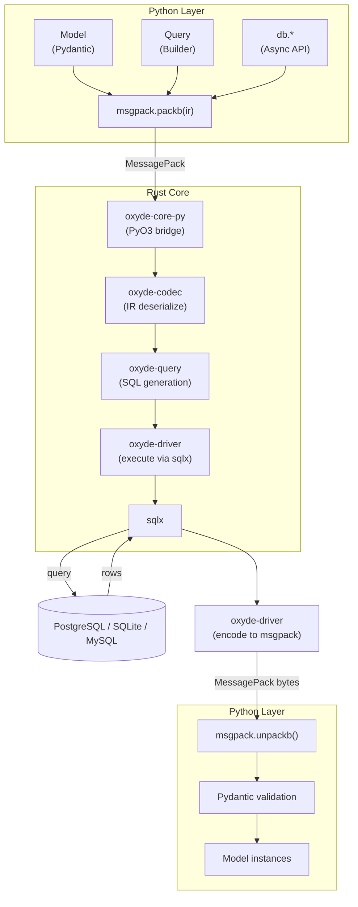
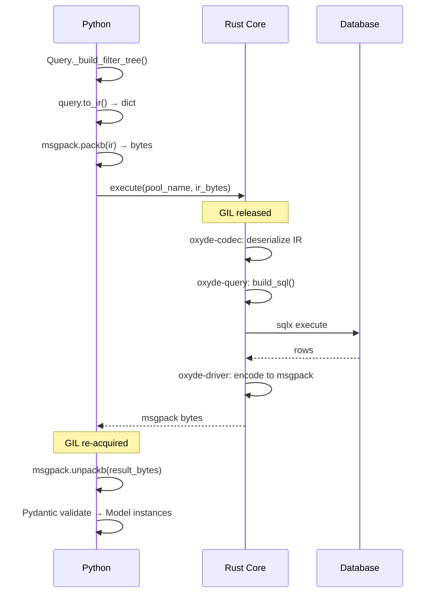

# Internals (Rust Core)

This section documents Oxyde's Rust architecture for advanced users and contributors.

## Architecture Overview



## Rust Crates

### oxyde-codec

**Purpose**: Define and validate the IR (Intermediate Representation) protocol.

**Location**: `crates/oxyde-codec/src/lib.rs`

Key types:

```rust
pub struct QueryIR {
    pub op: Operation,
    pub table: String,
    pub cols: Option<Vec<String>>,
    pub filter_tree: Option<FilterNode>,
    pub limit: Option<i64>,
    pub offset: Option<i64>,
    pub order_by: Option<Vec<(String, String)>>,
    pub values: Option<HashMap<String, rmpv::Value>>,
    pub col_types: Option<HashMap<String, String>>,
    pub joins: Option<Vec<JoinSpec>>,
    pub aggregates: Option<Vec<Aggregate>>,
    pub group_by: Option<Vec<String>>,
    pub having: Option<FilterNode>,
    pub returning: Option<bool>,
    pub distinct: Option<bool>,
    // ... more fields (bulk_values, union_query, etc.)
}

pub enum Operation {
    Select,
    Insert,
    Update,
    Delete,
    Raw,
}

pub enum FilterNode {
    Condition(Filter),
    And { conditions: Vec<FilterNode> },
    Or { conditions: Vec<FilterNode> },
    Not { condition: Box<FilterNode> },
}

pub struct Filter {
    pub field: String,
    pub operator: String,
    pub value: rmpv::Value,
    pub column: Option<String>,
}
```

### oxyde-query

**Purpose**: Generate SQL from IR using sea-query.

**Location**: `crates/oxyde-query/src/`

Modules: `builder/` (select, insert, update, delete, bulk), `filter/`, `aggregate/`, `utils/`, `error/`.

Key functions:

```rust
pub fn build_sql(ir: &QueryIR, dialect: Dialect) -> Result<(String, Vec<Value>)> {
    match ir.op {
        Operation::Select => build_select(ir, dialect),
        Operation::Insert => build_insert(ir, dialect),
        Operation::Update => build_update(ir, dialect),
        Operation::Delete => build_delete(ir, dialect),
        Operation::Raw => build_raw(ir, dialect),
    }
}

pub enum Dialect {
    Postgres,
    Sqlite,
    Mysql,
}
```

### oxyde-driver

**Purpose**: Connection pooling, query execution, transaction management.

**Location**: `crates/oxyde-driver/src/`

Modules: `pool/` (registry, handle, api), `transaction/` (registry, inner, api), `convert/` (encoder, postgres, sqlite, mysql), `execute/` (query, insert, traits), `bind/`, `explain/`.

Key components:

```rust
// Global registries (once_cell::sync::OnceCell)
static REGISTRY: OnceCell<ConnectionRegistry> = OnceCell::new();
static TRANSACTION_REGISTRY: OnceCell<TransactionRegistry> = OnceCell::new();

// Pool handle for each connection
pub struct PoolHandle {
    pub(crate) backend: DatabaseBackend,
    pub(crate) pool: DbPool,
}

pub enum DbPool {
    Postgres(PgPool),
    MySql(MySqlPool),
    Sqlite(SqlitePool),
}

// Transaction management
pub(crate) struct TransactionInner {
    pub(crate) _pool_name: String,
    pub(crate) _backend: DatabaseBackend,
    pub(crate) conn: Option<DbConn>,
    pub(crate) state: TransactionState,
    pub(crate) created_at: Instant,
    pub(crate) last_activity: Instant,
}
```

### oxyde-migrate

**Purpose**: Schema diffing and migration generation.

**Location**: `crates/oxyde-migrate/src/`

Modules: `diff.rs` (schema diff), `op.rs` (migration operations), `sql.rs` (SQL generation via sea-query), `types.rs` (Dialect, Snapshot, errors).

Key functions:

```rust
// Compute diff between two schema snapshots
pub fn compute_diff(old: &Snapshot, new: &Snapshot) -> Vec<MigrationOp>

// Migration struct with SQL generation
pub struct Migration {
    pub name: String,
    pub operations: Vec<MigrationOp>,
}

impl Migration {
    pub fn to_sql(&self, dialect: Dialect) -> Result<Vec<String>>
}
```

### oxyde-core-py

**Purpose**: PyO3 bindings exposing Rust functions to Python.

**Location**: `crates/oxyde-core-py/src/`

Modules: `execute.rs` (query execution), `pool.rs` (pool management), `migration.rs` (migration helpers), `convert.rs` (type conversion), `types.rs`.

Exposed functions:

```rust
// Pool management (pool.rs)
#[pyfunction]
fn init_pool<'py>(py: Python<'py>, name: String, url: String,
    settings: Option<HashMap<String, JsonValue>>) -> PyResult<Bound<'py, PyAny>>

// Query execution (execute.rs)
#[pyfunction]
fn execute<'py>(py: Python<'py>, pool_name: String,
    ir_bytes: &Bound<'py, PyBytes>) -> PyResult<Bound<'py, PyAny>>

// Transactions (execute.rs)
#[pyfunction]
fn begin_transaction<'py>(py: Python<'py>, pool_name: String) -> PyResult<Bound<'py, PyAny>>
fn commit_transaction<'py>(py: Python<'py>, tx_id: u64) -> PyResult<Bound<'py, PyAny>>
fn rollback_transaction<'py>(py: Python<'py>, tx_id: u64) -> PyResult<Bound<'py, PyAny>>
```

All async functions use `pyo3_async_runtimes::tokio::future_into_py` to return Python coroutines.

## Data Flow

### Query Execution



### IR Format Example

```python
# Python query
User.objects.filter(age__gte=18, status="active").order_by("-created_at").limit(10)

# Generated IR (Python dict → MessagePack)
{
    "op": "select",
    "table": "users",
    "model": "myapp.models.User",
    "cols": ["id", "name", "email", "age", "status", "created_at"],
    "filter_tree": {
        "type": "and",
        "conditions": [
            {"type": "condition", "field": "age", "operator": "gte", "value": 18},
            {"type": "condition", "field": "status", "operator": "eq", "value": "active"}
        ]
    },
    "order_by": [["created_at", "desc"]],
    "limit": 10
}
```

## GIL Release

Rust async operations release Python's GIL:

```rust
#[pyfunction]
fn execute<'py>(py: Python<'py>, pool_name: String,
    ir_bytes: &Bound<'py, PyBytes>) -> PyResult<Bound<'py, PyAny>> {
    // Copy bytes while holding GIL
    let ir_data = ir_bytes.as_bytes().to_vec();

    // Release GIL for async I/O
    pyo3_async_runtimes::tokio::future_into_py(py, async move {
        // This runs without GIL
        let ir = QueryIR::from_msgpack(&ir_data)?;
        let result = execute_query(&ir).await?;
        Ok(result)
    })
}
```

## Connection Registry

Global registry for connection pools:

```rust
pub(crate) struct ConnectionRegistry {
    pools: RwLock<HashMap<String, PoolHandle>>,
}

impl ConnectionRegistry {
    pub async fn insert(&self, name: String, handle: PoolHandle) -> Result<()> {
        let mut guard = self.pools.write().await;
        if guard.contains_key(&name) {
            return Err(DriverError::PoolAlreadyExists(name));
        }
        guard.insert(name, handle);
        Ok(())
    }

    pub async fn insert_or_replace(&self, name: String, handle: PoolHandle) -> Option<PoolHandle>
}
```

## Transaction Management

Transactions are stored in a separate registry:

```rust
pub(crate) struct TransactionRegistry {
    transactions: RwLock<HashMap<u64, Arc<Mutex<TransactionInner>>>>,
    pool_settings: RwLock<HashMap<String, PoolTimeoutSettings>>,
    locked_counts: Mutex<HashMap<u64, u32>>,
}

// Transaction IDs are generated by a separate atomic counter:
pub(crate) static TRANSACTION_ID: AtomicU64 = AtomicU64::new(1);
```

## Building from Source

```bash
# Build all crates
cargo build --release

# Build Python extension
cd crates/oxyde-core-py
maturin develop --release

# Run Rust tests
cargo test --workspace

# Run with logging
RUST_LOG=debug cargo test
```

## Debugging

### Enable Rust Logging

```bash
export RUST_LOG=info  # or debug, trace
python your_script.py
```

### Inspect IR

```python
query = User.objects.filter(age__gte=18)
ir = query.to_ir()
from pprint import pprint
pprint(ir)
```

### Check SQL

```python
sql, params = query.sql(dialect="postgres")
print(sql)
print(params)
```

## Performance Considerations

### MessagePack Overhead

- Typical IR size: 1-3KB
- Serialization: ~50μs
- Deserialization: ~30μs
- Negligible compared to network I/O

### SQL Generation

- sea-query is highly optimized
- SQL building: ~10-50μs per query
- Cached prepared statements in sqlx

### Connection Pool

- Pool acquisition: ~1μs (cached)
- New connection: ~1-10ms (database dependent)
- Keep `min_connections > 0` for production

## Contributing

### Adding a New Operation

1. Define IR in `oxyde-codec`:
   ```rust
   pub struct NewOperationIR { ... }
   ```

2. Add SQL generation in `oxyde-query`:
   ```rust
   fn build_new_operation(ir: &NewOperationIR, dialect: Dialect) -> Result<...>
   ```

3. Expose in `oxyde-core-py`:
   ```rust
   #[pyfunction]
   fn new_operation(...) -> PyResult<...>
   ```

4. Add Python wrapper in `python/oxyde/queries/`

5. Rebuild:
   ```bash
   cd crates/oxyde-core-py && maturin develop --release
   ```

## Next Steps

- [Performance](performance.md) — Optimization techniques
- [Raw Queries](raw-queries.md) — Direct SQL execution
- [Connections](../guide/connections.md) — Connection configuration
